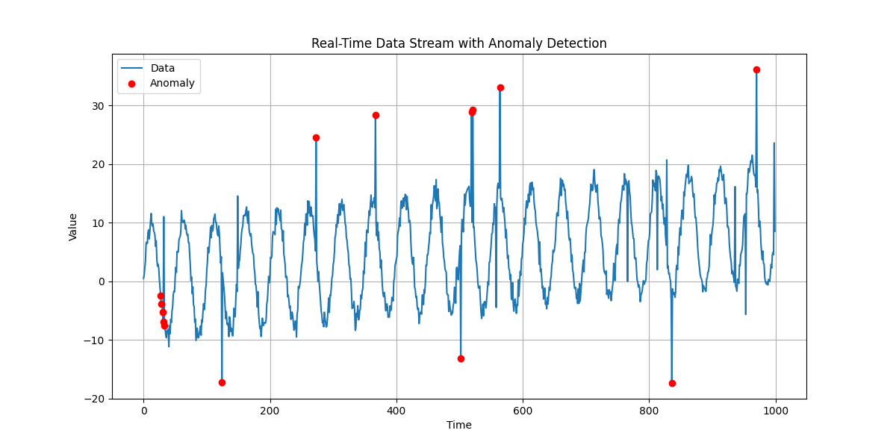
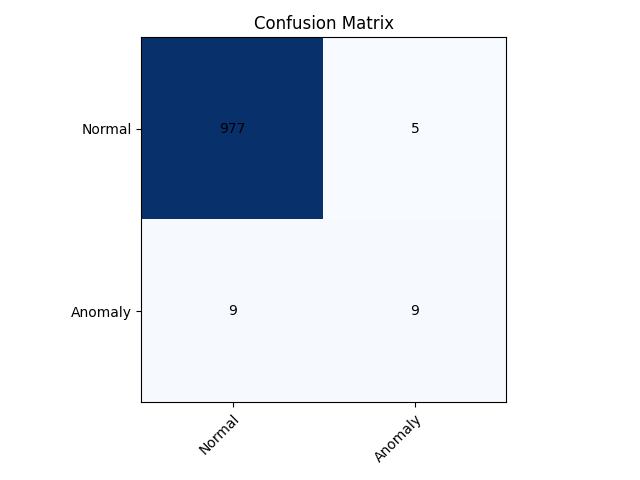
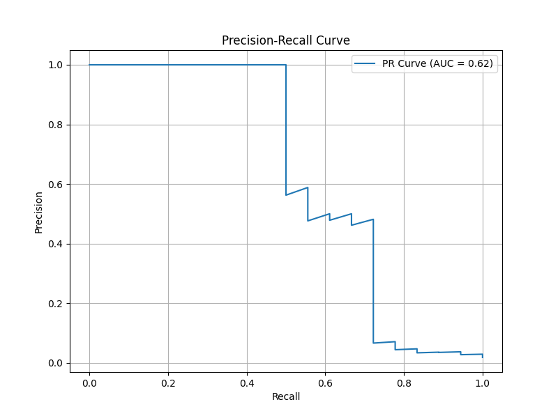

# Efficient Data Stream Anomaly Detection

## Table of Contents

- [Overview](#overview)
- [Features](#features)
- [Getting Started](#getting-started)
  - [Prerequisites](#prerequisites)
  - [Installation](#installation)
- [Usage](#usage)
  - [Running the Anomaly Detection System](#running-the-anomaly-detection-system)
  - [Viewing Results](#viewing-results)
- [Contributing](#contributing)
- [License](#license)
- [Acknowledgments](#acknowledgments)

## Overview

The **Efficient Data Stream Anomaly Detection** project is designed to identify irregular patterns and anomalies in continuous data streams in real-time. Leveraging statistical methods and adaptive techniques, the system ensures high accuracy and efficiency, making it suitable for applications in finance, cybersecurity, system health monitoring, and more.

## Features

- **Real-Time Processing**: Capable of handling high-velocity data streams with minimal latency.
- **Adaptive Sliding Window**: Dynamically updates statistical measures to accommodate concept drift and seasonal variations.
- **Z-Score Based Detection**: Utilizes Z-Score statistics to identify significant deviations from established patterns.
- **Comprehensive Evaluation**: Includes performance metrics such as Confusion Matrix and Precision-Recall (PR) Curve.
- **Real-Time Visualization**: Provides dynamic plots to monitor data streams and detected anomalies.

## Getting Started

Follow these instructions to set up and run the anomaly detection system on your local machine.

### Prerequisites

Ensure that you have the following installed on your system:

- **Python 3.7 or higher**: [Download Python](https://www.python.org/downloads/)
- **pip**: Python package installer (usually comes with Python)

### Installation

1. **Clone the Repository**

   ```bash
   git clone https://github.com/TanmayB2003/anomaly-detection.git
   cd anomaly-detection
   ```

2. **Create a Virtual Environment (Optional but Recommended)**

   ```bash
   python -m venv venv
   ```

3. **Activate the Virtual Environment**

   - **Windows**

     ```bash
     venv\Scripts\activate
     ```

   - **macOS and Linux**

     ```bash
     source venv/bin/activate
     ```

4. **Install Dependencies**

   ```bash
   pip install -r requirements.txt
   ```

## Usage

### Running the Anomaly Detection System

Execute the main script to start the anomaly detection process.

```bash
python anomaly_detection.py
```

> **Note**: Ensure that all required dependencies are installed and the virtual environment is activated if you are using one.

### Viewing Results

After running the system, the following outputs will be generated:

1. **Real-Time Plot**

   - **Description**: A dynamic plot displaying the data stream with detected anomalies highlighted.
   - **Location**: `all_plots/real_time_plot.png`

    <!-- Update the path as necessary -->

2. **Confusion Matrix**

   - **Description**: A matrix summarizing the performance of the anomaly detection system, distinguishing between true positives, false positives, true negatives, and false negatives.
   - **Location**: `all_plots/confusion_matrix.png`

    <!-- Update the path as necessary -->

3. **Precision-Recall Curve**

   - **Description**: A graph illustrating the trade-off between precision and recall at various threshold settings.
   - **Location**: `all_plots/precision_recall_curve.png`

    <!-- Update the path as necessary -->

4. **Comprehensive Report**

   - **Description**: A detailed report analyzing the anomaly detection system's methodology, implementation, and performance metrics.
   - **Location**: `report.pdf`

## Contributing

Contributions are welcome! Please follow these steps to contribute:

1. **Fork the Repository**

2. **Create a New Branch**

   ```bash
   git checkout -b feature/YourFeatureName
   ```

3. **Make Your Changes**

4. **Commit Your Changes**

   ```bash
   git commit -m "Add Your Feature"
   ```

5. **Push to the Branch**

   ```bash
   git push origin feature/YourFeatureName
   ```

6. **Create a Pull Request**

Please ensure that your contributions adhere to the project's coding standards and include appropriate documentation.

## License

This project is licensed under the [MIT License](LICENSE).

## Acknowledgments

- Inspired by various studies and methodologies in anomaly detection and data stream processing.
- Special thanks to the contributors and the open-source community for their invaluable resources and support.
